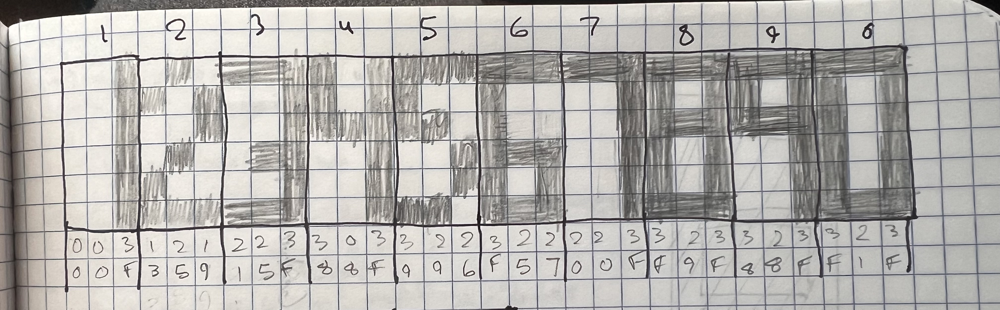

H-CAT Project Gallery

Welcome to the visual documentation of the H-CAT project. This gallery showcases the development process from initial concept to working prototype.

## Prototype

## Concept Sketches

*Initial project sketches, enclosure design - minimum size is based on arduino board, laying out components and feature planning, 2 compartment design*

*Initial project sketches, mode planning and feature prioritization, input design, parts breakdown, and early wiring sketch*

*Planning reflector angle and front-panel cutout size, optimized for viewing angle*

*Custom numeral design for clock display using 3x6 grid pattern (with HEX values for each column)*

## Clock Mode

*Clock mode in digital clock format*

*Binary Clock - 12-hour clock format with 6 columns left to right showing 05:41:02*

*Binary Clock - 24-hour clock format with 6 columns left to right showing 17:40:58*

## Cellular Automata

*Interactive Game of Life mode - several stable patterns are regularely spawned in either Red, Green, or Blue. They interact accoring to the standard Game of Life rules. Child nodes are colored based on their parent's color.*

*Layered Game of Life visualization - 3 separate Game of Life patterns layered on top of each other, that do not interact with each other. Dead cells are randomly reactivated in order to keep the patterns alive.*

## Diffusion-Limited Aggregation

*A floater node is randomly spawned and drifts until it collides with a stationary node, where it then becomes stationary itself. This process builds a branching structure over time. Node placement and drift can be adjusted.*

## 
